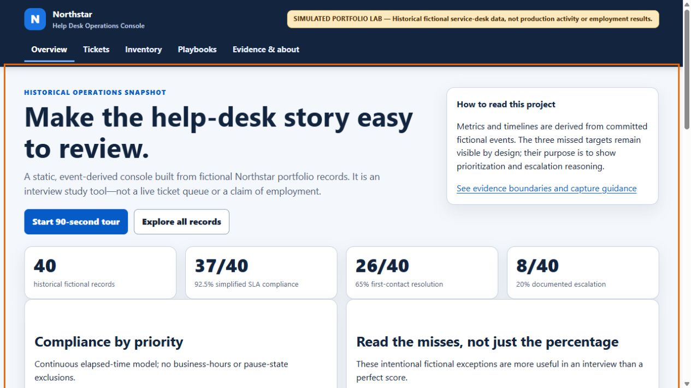
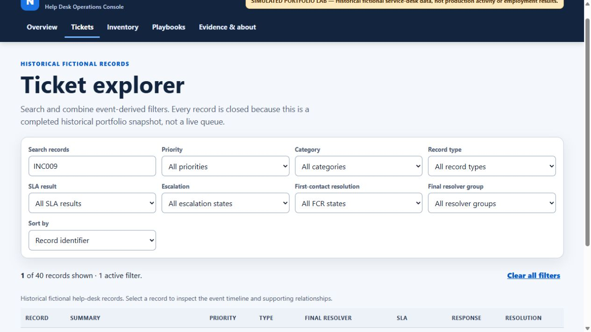
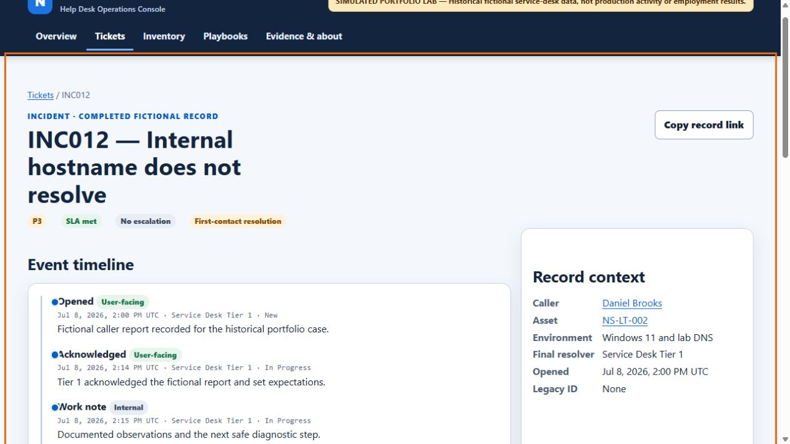
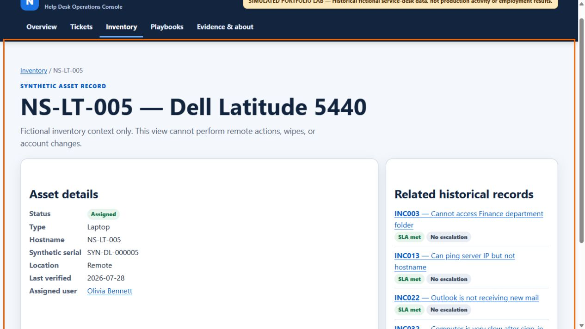

# Northstar Help Desk Operations Console

> **SIMULATED PORTFOLIO LAB — Historical fictional service-desk data, not production activity or employment results.** Northstar Solutions, its people, assets, cases, timestamps, and metrics are fictional. This repository does not claim employer work, production access, or third-party platform administration.



Northstar is an offline-capable help-desk portfolio lab designed around the journey a remote Tier 1 analyst needs to explain: intake, safe diagnosis, clear user communication, escalation boundaries, identity lifecycle awareness, inventory context, and reproducible reporting.

The project is deliberately not a fake production ServiceNow clone. It is a static historical operations console built from validated fictional data, plus optional lab scripts that refuse to operate outside a marked `northstar.example` Active Directory learning environment.

## Start here — a three-minute reviewer path

1. Run the local console and choose **Start 90-second tour**.
2. Read [INC012](tickets/generated/INC012.md) for a DNS diagnosis, [INC009](tickets/generated/INC009.md) for a security escalation, and [INC040](tickets/generated/INC040.md) for a time-sensitive meeting issue.
3. Inspect the event-derived [SLA report](docs/metrics/SLA_REPORT.md), then review the [PowerShell safety model](docs/ACTIVE_DIRECTORY_LAB.md).
4. Use the [demo script](docs/DEMO_SCRIPT.md) to rehearse how to explain the project in an interview.

## What the project demonstrates

| Area | Evidence in this repository |
|---|---|
| Help-desk workflow | 40 fictional incidents and requests, each with an event timeline, diagnostic narrative, resolution, validation, and user communication |
| ITSM data modeling | Separate incidents and service requests, legacy ID mapping, request items/tasks, final resolver groups, priority matrix, and event-derived results |
| Remote-support judgment | Clear user updates, documented scope, safe escalation handoffs, and intentionally retained difficult cases |
| Windows and networking | Read-only Windows DNS/ICMP/TCP/route triage script and documented troubleshooting cases |
| Identity lifecycle | Sentinel-marked AD lab structure, disabled synthetic user import, guarded account support, onboarding, and offboarding workflows |
| Asset management | 20 synthetic assets connected to fictional people, lifecycle status, and related records |
| Knowledge management | Twelve linked Tier 1 articles, including access-change and offboarding guidance |
| Reproducibility | Standard-library generator, validation, generated console data, unit tests, Pester safety tests, CI, and commit-exact packaging |

## What it does **not** demonstrate

- Employment supporting real users, a production SLA, or a real 75-person company.
- Live ServiceNow, Active Directory, Microsoft 365, Entra ID, Intune, Autopilot, VPN, or security-console administration.
- A replacement for a production ITSM tool, security process, approval workflow, or change-control system.

Add `LAB-EXECUTED` evidence only after personally performing a task in an authorized learning lab and redacting the capture. See [the evidence guide](docs/EVIDENCE_GUIDE.md).

## Run it locally (Windows)

You only need Python 3.10+ to view the console. You do **not** need ServiceNow, Active Directory, Microsoft 365, or an internet connection after cloning.

### First time: copy and paste this into PowerShell

Open PowerShell, then paste the whole block. The first line deliberately moves you out of `C:\Windows\System32`, which avoids the permission error that occurs when Git tries to create a project folder there.

```powershell
cd "$env:USERPROFILE\Documents"
git clone https://github.com/vxti-glitch/enterprise-helpdesk-operations-lab.git
cd .\enterprise-helpdesk-operations-lab
python tools\labtool.py generate --strict-baseline
python tools\labtool.py validate --strict-baseline
python tools\labtool.py serve --open
```

Your browser should open automatically. If it does not, open [http://127.0.0.1:8000/](http://127.0.0.1:8000/) yourself. Keep the PowerShell window open while using the console; press `Ctrl+C` there when you are finished to stop the local server.

### If you already downloaded or cloned the project

Do **not** clone it again. Open PowerShell and run this instead:

```powershell
cd "$env:USERPROFILE\Documents\enterprise-helpdesk-operations-lab"
python tools\labtool.py serve --open
```

If your copy is stored elsewhere, open its folder in File Explorer, click the address bar, type `powershell`, press Enter, and then run `python tools\labtool.py serve --open`.

### If PowerShell says `python` is not recognized

Install Python 3 from the Microsoft Store or [python.org](https://www.python.org/downloads/), reopen PowerShell, then repeat the command. On some Windows installations, replace `python` with `py` in the commands above.

Run the full local check set:

```powershell
.\scripts\powershell\Test-Repository.ps1
```

Or run individual checks:

```powershell
python -m unittest discover -s tests -v
node --test web/filters.test.mjs
Invoke-Pester .\tests\powershell\NorthstarLabGuard.Tests.ps1
```

## Console views

| View | Purpose |
|---|---|
| Overview | Makes the simulated-data boundary, event-derived metrics, priority compliance, and retained misses clear immediately |
| Tickets | Search, combine filters, sort, inspect responsive cards, and follow reloadable deep links |
| Ticket detail | Review a UTC event timeline, diagnostic narrative, SLA comparison, related asset/user/KB/evidence, and escalation handoff |
| Inventory | Follow fictional asset → person → ticket relationships without fake destructive controls |
| Playbooks | Read onboarding, offboarding, KB, escalation, and trust-boundary guidance |
| Evidence & about | See what is simulated, which sample outputs exist, and how to add personally executed lab evidence honestly |

More genuine application views displaying simulated data:

| Filtered record queue | DNS ticket detail | Asset relationship |
|---|---|---|
|  |  |  |

## Data and architecture

```text
fictional CSV records + event history
        │
        ▼
schema / relationship / path-containment validation
        │
        ├── generated record Markdown
        ├── event-derived SLA report and JSON
        ├── separate incident and request staging CSVs
        └── static Operations Console payload
```

`data/ticket_events.csv` is the source for acknowledgement, escalation, first-contact resolution, resolution, and closure timing. Summary timestamps and flags in `data/tickets.csv` are checked against the event history; the metrics engine does not trust them as its source of truth.

Read [the architecture](docs/ARCHITECTURE.md) and [data dictionary](docs/DATA_DICTIONARY.md) for precise relationships, limits, and safety controls.

## Active Directory lab safety

The mutation scripts are intentionally narrow:

- They cannot be retargeted from the fixed `northstar.example` synthetic domain.
- They require `OU=Northstar Lab` to carry a specific synthetic-lab sentinel.
- They reject users and groups outside that marked OU, service accounts, protected objects, administrative objects, and non-allowlisted groups.
- State-changing actions require `-Execute`, a fictional `INC###` or `REQ###` ID, `ShouldProcess`, and secret-free local audit output.
- `-WhatIf` creates a plan without prompting for a password or changing state.

See [the AD lab guide](docs/ACTIVE_DIRECTORY_LAB.md) before running a script in an isolated learning environment.

## GitHub Pages

The repository includes a Pages deployment workflow. After the branch is merged, enable **Settings → Pages → Build and deployment → GitHub Actions** once. The site is static and deploys only the generated `web/` directory.

## Honest resume language

> **Northstar Help Desk Operations Console | Python, PowerShell, ITSM, Windows Support**
> Built a fictional, event-derived help-desk portfolio lab with a static console for 40 documented incidents and service requests spanning identity, Microsoft 365 concepts, endpoint, networking, inventory, and security triage.
> Created validated ticket/event data, safe Active Directory lab scripts, knowledge articles, lifecycle workflows, and reproducible simplified SLA reporting; clearly labeled all records and metrics as simulated.

Use words such as **built**, **modeled**, **simulated**, **lab**, and **documented**. Do not claim to have supported real users or maintained a production SLA.

## License and attribution

Code is available under the [MIT License](LICENSE). The fictional data and documentation are reusable with attribution, but should be rewritten and customized before being presented as another person's work.
