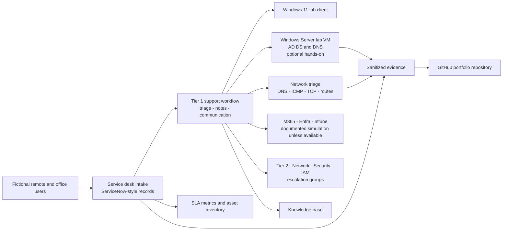

# Lab architecture

Northstar Solutions is a fictional 75-person hybrid company. The support boundary is intentionally small enough to reproduce on one computer while still demonstrating enterprise-style handoffs.

## Logical components

| Component | Purpose | Required? | State in this repository |
|---|---|---:|---|
| Ticket dataset | Source of incidents, requests, notes, and timestamps | Yes | Fully simulated CSV plus generated Markdown |
| Asset inventory | Ownership and lifecycle context | Yes | 20 synthetic devices |
| SLA engine | Reproducible response/resolution calculations | Yes | Runnable standard-library Python |
| AD/DNS server | Identity and internal name-resolution practice | No | Build guide and guarded scripts |
| Windows client | Endpoint and remote-support practice | No | Cases and evidence plan |
| ServiceNow PDI | ITSM interface practice | No | Field mapping and recreation guide |
| M365 lab tenant | Cloud identity/application practice | No | Controlled simulation unless independently available |

## Identity design

- DNS root: `northstar.example` (reserved for documentation)
- NetBIOS name: `NORTHSTAR`
- Top-level lab OU: `OU=Northstar Lab,DC=northstar,DC=example`
- Department OUs: Finance, HR, Sales, Operations, Engineering, Management
- Control OUs: Disabled Users, Service Accounts, Workstations
- Groups use a `GG-` prefix and are listed in `data/groups.csv`

## Trust boundaries

The repository is outside every real tenant and corporate network. No script automatically connects to Microsoft Graph, ServiceNow, a VPN, or an unknown AD domain. AD mutation requires two independent conditions: the `-Execute` switch and an exact domain-root match.

## Data flow

CSV files under `data/` are the source of truth. `tools/labtool.py generate` renders individual ticket records, an import-mapping CSV, a metrics report, and a machine-readable evidence summary. Validation detects missing relationships and stale derived files.
